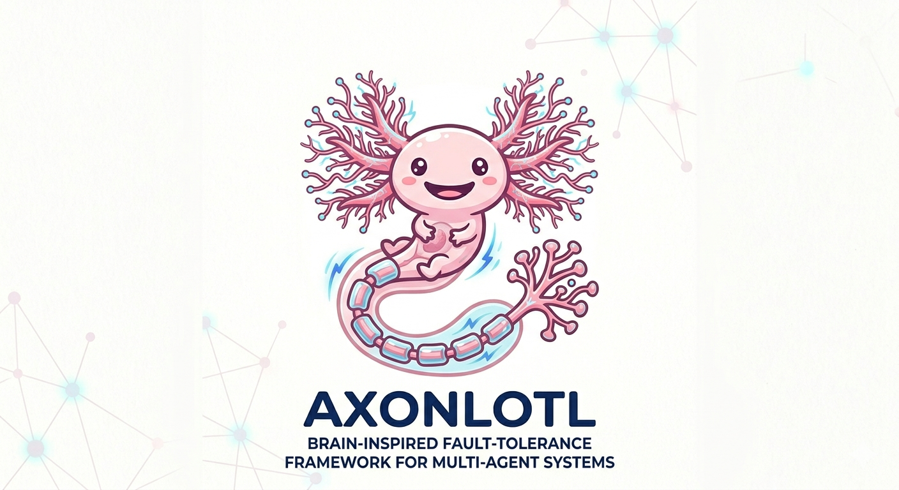

# Axonlotl

Brain-inspired self-healing infrastructure for multi-agent systems — built for the **Google I/O Hackathon 2026 (Cerebral Valley, May 23, 2026)**.

Axonlotl runs a multi-agent pipeline (planner → coder → reviewer → tester → deployer) and keeps it alive under failures, semantic drift, and latency by applying “brain protocols”:

- **Pattern 1 — Fast Path (Experience-Independent Baseline):** run normally when healthy
- **Pattern 3 — Lesion Recovery (Functional Rerouting):** bypass dead/critical agents using capability overlap
- **Pattern 2 — LTP (Experience-Dependent Structural Adaptation):** strengthen successful bypass “synapses” (route weights) over time



.png)

## What The Hackathon Demo Shows

- **Semantic drift detection:** middleware flags generic/low-quality outputs (e.g. “LGTM” on complex code)
- **Graceful degradation:** prompts get shorter / stricter when health is low
- **Compensatory rerouting:** when an agent is killed or drifts, Axonlotl reroutes to a backup agent in *coverage mode*
- **Neuroplasticity:** successful reroutes increase `routeWeights[A→B].weight`, making the same detour faster/stronger next time
- **“Managed Brain” analysis:** a managed Gemini agent (Axonlotl Core / “Prefrontal Cortex”) produces a 1‑sentence medical verdict after each run, with a safe fallback so the demo doesn’t break

## Dashboard “Tags” / Protocol Indicators

Inside the UI you’ll see:

- Node status tag: `IDLE`, `ACTIVE`, `DEAD`, `COVERAGE MODE (…% OVERLAP)`
- Synaptic Ledger (protocol trace):
  - `[PROTOCOL] Pattern 1 … Fast Path engaged for <agent>`
  - `[CRITICAL] Pattern 3 … Lesion Recovery triggered. Bypassing <failed>`
  - `[LEARNING] Pattern 2 … LTP. Strengthening synapse A→B to <weight>`

## Quickstart

1) Install deps:

```bash
npm install
```

2) Set your key:

- Copy `.env.example` → `.env`
- Set `GEMINI_API_KEY=...`

3) Run:

```bash
npm run dev
```

Open `http://127.0.0.1:${PORT:-8787}` (or the `HOST`/`PORT` in your `.env`).

## Demo Controls (UI)

- **REFRESH NETWORK**: reset to a healthy baseline (all agents `health=1.0`, route weights reset)
- **Simulate Stroke**: kills multiple nodes and runs Axonlotl to show multi-node lesion recovery
- **Chaos**: starts the shadow pipeline (periodic random faults) and updates gauges in real time
- Per-node toggle: kill/heal a specific agent instantly

## Useful Endpoints

- `GET /api/state` — current network state
- `POST /api/reset_network` — healthy baseline reset
- `POST /inject_fault` — inject fault (`kill|degrade|hallucinate|slow`)
- `POST /api/run` or `POST /run_pipeline` — run pipeline in `axonlotl` or `brittle` mode
- `POST /api/diagnose` — managed-agent diagnosis (returns `note` + structured payload)

## Test / Verification Script

Run the end-to-end recovery verification (kills reviewer, runs pipeline, checks reroute + weights + diagnosis):

```bash
./test-recovery.sh
```
